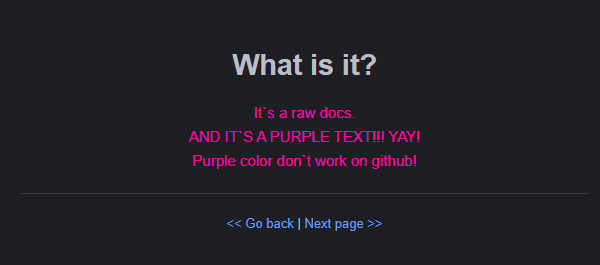

<h1 align="center">What is it?</h1>

    It`s a raw docs.
     
    AND IT`S A PURPLE TEXT!!! YAY!
     
    Purple color don`t work on github!

--- 

    <b>
        ▼ ▼ ▼ ▼ ▼ ▼ ▼ ▼ ▼ ▼ ▼ ▼ ▼ ▼ ▼ ▼ ▼ ▼ ▼ ▼ ▼ ▼ ▼ ▼ ▼ ▼ ▼ ▼ ▼ ▼ ▼ ▼ ▼ ▼
    </b>
     
    
     
    <b>
        ▲ ▲ ▲ ▲ ▲ ▲ ▲ ▲ ▲ ▲ ▲ ▲ ▲ ▲ ▲ ▲ ▲ ▲ ▲ ▲ ▲ ▲ ▲ ▲ ▲ ▲ ▲ ▲ ▲ ▲ ▲ ▲ ▲ ▲ 
    </b>

---

<a href="../../README.md"> << Go back</a>
|
<a href="./core.progress.md"> Next page >> </a>

