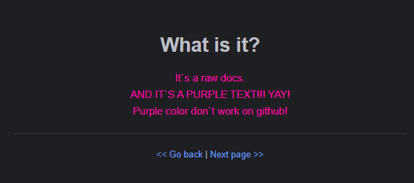

<h1 align="center">What is it?</h1>

    Это сырая версия документации. Тк она в данный момент не в приоритете - Вы будете читать именно это.
     
    И ФИОЛЕТОВЫЙ ТЕКСТ!!!
     
    Он не работает на гитхабе..

---

    <b>
        ▼ ▼ ▼ ▼ ▼ ▼ ▼ ▼ ▼ ▼ ▼ ▼ ▼ ▼ ▼ ▼ ▼ ▼ ▼ ▼ ▼ ▼ ▼ ▼ ▼ ▼ ▼ ▼ ▼ ▼ ▼ ▼ ▼ ▼
    </b>
     
    
     
    <b>
        ▲ ▲ ▲ ▲ ▲ ▲ ▲ ▲ ▲ ▲ ▲ ▲ ▲ ▲ ▲ ▲ ▲ ▲ ▲ ▲ ▲ ▲ ▲ ▲ ▲ ▲ ▲ ▲ ▲ ▲ ▲ ▲ ▲ ▲
    </b>

---

<a href="../../../README.md"> << Go back</a>
|
<a href="core.progress.md"> Next page >> </a>

