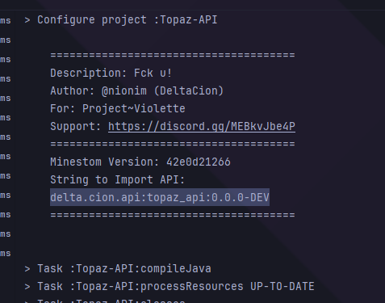

<h2 align="center">Ваш первый плагин</h2>
	

		Вообще тут будут описаны лишь основы разработки под это ядро, тк большая часть смешна с разработкой на либе Minestom (На которой это ядро и написано).
	

<h3 align="center">О Topaz-API</h3>
	

		Такс.. Пока самой апишки нет на maven репозиториях - Вам придется либо скопировать её в проект, либо самостоятельно сбилдить.
		 
		Для билда - Можно прописать:
		"./gradlew :Decadence-API:publishToMavenLocal"
		  
		Строка, требуемая для импорта в проект будет выведена во время билда.
		 
		Будет что-то типо:
		"decadence.api:topaz_api:0.0.0-DEV"
		 
		
		 
		Скриншот устарел,
		 
		`delta.cion` было заменено на `decadence` во всех пакетах
	

